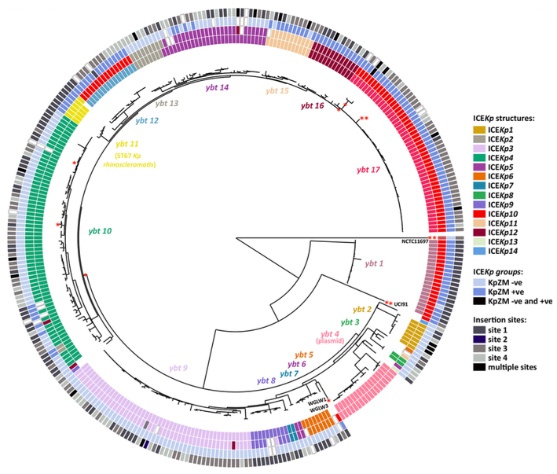
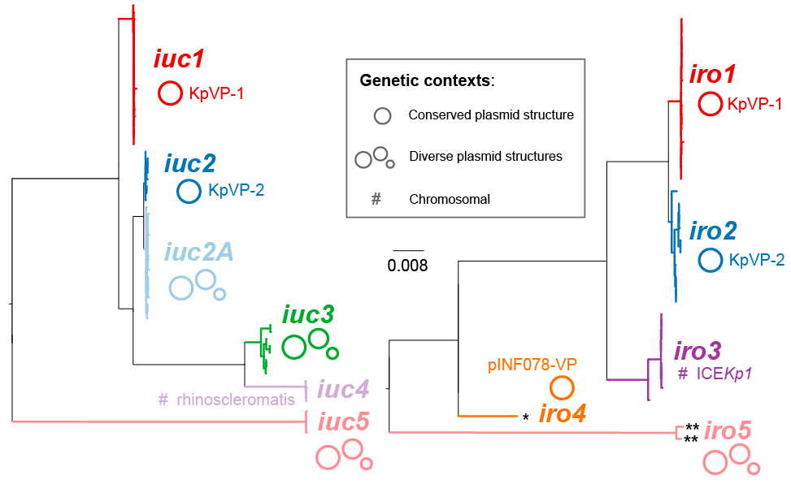

<p align="center"></p>

Kleborate is a tool to screen genome assemblies of _Klebsiella pneumoniae_ and the _Klebsiella pneumoniae_ species complex (KpSC) for:
 * MLST sequence type
 * species (e.g. _K. pneumoniae_, _K. quasipneumoniae_, _K. variicola_, etc.)
 * ICE<i>Kp</i> associated virulence loci: yersiniabactin (_ybt_), colibactin (_clb_)
 * virulence plasmid associated loci: salmochelin (_iro_), aerobactin (_iuc_), hypermucoidy (_rmpA_, _rmpA2_)
 * antimicrobial resistance genes, including quinolone resistance SNPs and colistin resistance truncations
 * K (capsule) and O antigen (LPS) serotype prediction, via _wzi_ alleles and [Kaptive](https://github.com/katholt/Kaptive)
 
For _Klebsiella_ outside of the KpSC, Kleborate will accurately determine the species and will report the presence of any accessory genes detected (AMR, virulence, K & O types); however species-focused markers (mutational resistance, MLST) will not be reported.

A manuscript describing the Kleborate software in full is currently in preparation. (Note that the BLAST logic has been checked in the light of [this article](https://doi.org/10.1093/bioinformatics/bty833) describing a common misconception regarding the BLAST parameter -max_target_seqs.)

In the meantime, if you use Kleborate, please cite the component schemes that you report:<br>
> Yersiniabactin and colibactin (ICE<i>Kp</i>) [Lam, MMC. et al. Genetic diversity, mobilisation and spread of the yersiniabactin-encoding mobile element ICE<i>Kp</i> in _Klebsiella pneumoniae_ populations. _Microbial Genomics_ (2018).](http://mgen.microbiologyresearch.org/content/journal/mgen/10.1099/mgen.0.000196)

> Aerobactin and salmochelin:
[Lam, MMC. et al. Tracking key virulence loci encoding aerobactin and salmochelin siderophore synthesis in _Klebsiella pneumoniae_. _Genome Medicine_ (2018).](https://genomemedicine.biomedcentral.com/articles/10.1186/s13073-018-0587-5)

> Kaptive for capsule (K) serotyping:
[Wyres, KL. et al. Identification of _Klebsiella_ capsule synthesis loci from whole genome data. _Microbial Genomics_ (2016).](http://mgen.microbiologyresearch.org/content/journal/mgen/10.1099/mgen.0.000102)

> Kaptive for O antigen (LPS) serotyping:
[Wick, RR et. al. Kaptive Web: user-friendly capsule and lipopolysaccharide serotype prediction for _Klebsiella_ genomes. _Journal of Clinical Microbiology_ (2018).](http://jcm.asm.org/content/56/6/e00197-18)


## Table of Contents

* [Background](#background)
* [Requirements](#requirements)
* [Installation](#installation)
* [Basic usage](#basic-usage)
* [Full usage](#full-usage)
* [Screening functions & outputs](#screening-details)
   * [Genome assembly quality metrics](#assembly-quality-metrics)
   * [<em>Klebsiella</em> species](#klebsiella-species)
   * [MLST](#mlst)
   * [Virulence loci](#virulence-loci)
   * [Resistance gene detection](#antimicrobial-resistance-determinants)
   * [Resistance & virulence scores and counts](#scores-and-counts)
   * [Serotype prediction](#serotype-prediction)
* [Example output](#example-output)
   * [Test data](#test-data)
   * [Concise results (stdout)](#concise-results-stdout)
   * [Full results (file)](#full-results-file)
* [Typing from Illumina reads](#typing-from-illumina-reads)
* [Contact us](#contact-us)
* [License](#license)


## Background

_Klebsiella pneumoniae_ (_Kp_) is a commensal bacterium that causes opportunistic infections, with a handful of hypervirulent lineages recognised as true human pathogens. Evidence is now mounting that other _Kp_ strains carrying acquired siderophores (yersiniabactin, salmochelin and aerobactin) and/or the genotoxin colibactin are also highly pathogenic and can cause invasive disease.

Our goal is to help identify emerging pathogenic _Kp_ lineages, and to make it easy for people who are using genomic surveillance to monitor for antibiotic resistance to also look out for the convergence of antibiotic resistance and virulence. To help facilitate that, in this repo we share code for genotyping virulence and resistance genes in _K. pneumoniae_. A table of pre-computed results for 2500 public Klebs genomes is also provided in the [data directory](https://github.com/katholt/Kleborate/data).


## Requirements

Software requirements:
* Python (either 2.7 or 3)
* [setuptools](https://pypi.python.org/pypi/setuptools) (required to install Kleborate)
  * To install: `pip install setuptools`
* BLAST+ command line tools (`makeblastdb`, `blastn`, etc.)
  * Version 2.7.1 or later is needed, as earlier versions have a bug with the `culling_limit` parameter and/or tblastx results.
  * We test Kleborate on BLAST+ v2.7.1. Later versions will probably also work but stick to v2.7.1 if you want to play it safe.
* [Mash](https://github.com/marbl/Mash)

As input, Kleborate takes _Klebsiella_ genome assemblies (either completed or draft). If you have unassembled reads, try assembling them with our [Unicycler](https://github.com/rrwick/Unicycler) assembler which works great on Illumina or hybrid Illumina + Nanopore/PacBio reads).


## Installation

Kleborate can be installed to your system for easy usage:

```bash
git clone --recursive https://github.com/katholt/Kleborate.git
cd Kleborate
python setup.py install
kleborate -h
```


Alternatively, you can clone and run Kleborate without installation directly from its source directory:

```bash
git clone --recursive https://github.com/katholt/Kleborate.git
Kleborate/kleborate-runner.py -h
```

See [examples below](#example-output) to test out your installation on some public genome data.


## Basic usage

__Screen some genomes for MLST and virulence loci:__<br>
`kleborate -o results.txt -a *.fasta`

__Also screen for resistance genes:__<br>
`kleborate --resistance -o results.txt -a *.fasta`

__Turn on all of Kleborate's optional screens (resistance genes, species check and both K and O loci):__<br>
`kleborate --all -o results.txt -a *.fasta`

__Screen everything in a set of gzipped assemblies:__<br>
`kleborate --all -o results.txt -a *.fasta.gz`


## Full usage

```
usage: kleborate -a ASSEMBLIES [ASSEMBLIES ...] [-r] [-s] [--kaptive_k]
                 [--kaptive_o] [-k] [--all] [-o OUTFILE]
                 [--kaptive_k_outfile KAPTIVE_K_OUTFILE]
                 [--kaptive_o_outfile KAPTIVE_O_OUTFILE] [-h] [--version]

Kleborate: a tool for characterising virulence and resistance in Klebsiella

Required arguments:
  -a ASSEMBLIES [ASSEMBLIES ...], --assemblies ASSEMBLIES [ASSEMBLIES ...]
                        FASTA file(s) for assemblies, can be gzipped (.gz)

Screening options:
  -r, --resistance      Turn on resistance genes screening (default: no
                        resistance gene screening)
  --kaptive_k           Turn on Kaptive screening of K loci (default: do not
                        run Kaptive for K loci)
  --kaptive_o           Turn on Kaptive screening of O loci (default: do not
                        run Kaptive for O loci)
  -k, --kaptive         Equivalent to --kaptive_k --kaptive_o
  --all                 Equivalent to --resistance --species --kaptive

Output options:
  -o OUTFILE, --outfile OUTFILE
                        File for detailed output (default:
                        Kleborate_results.txt)
  --kaptive_k_outfile KAPTIVE_K_OUTFILE
                        File for full Kaptive K locus output (default: do not
                        save Kaptive K locus results to separate file)
  --kaptive_o_outfile KAPTIVE_O_OUTFILE
                        File for full Kaptive O locus output (default: do not
                        save Kaptive O locus results to separate file)

Help:
  -h, --help            Show this help message and exit
  --version             Show program's version number and exit
```


## Screening details

### Assembly quality metrics

The quality and completeness of Kleborate results depends on the quality of the input genome assemblies. We provide some basic assembly statistics (contig count,	N50,	largest contig size) to help users understand their Kleborate results in the context of assembly quality, but we recommend users conduct more comprehensive QC themselves before running Kleborate (e.g. screen for contamination, etc).


### _Klebsiella_ species

Kleborate will attempt to identify the species of each input assembly. It does this by comparing the assembly using Mash to a curated set of _Klebsiella_ assemblies [from NCBI](https://www.ncbi.nlm.nih.gov/assembly) and reporting the species of the closest match. Kleborate considers a Mash distance of ≤ 0.01 to be a strong species match. A distance of > 0.01 and ≤ 0.03 is a weak match and might indicate that your sample is a novel lineage or a hybrid between multiple _Klebsiella_ species.

Here is an annotated tree of the reference assemblies, made by [mashtree](https://github.com/lskatz/mashtree):
<p align="center"></p>

Kleborate is designed for the well-studied _K. pneumoniae_ species complex (KpSC) labelled on the tree, which includes the seven species listed in the table below. These were previously considered as phylogroups within _K. pneumoniae_. We've included the phylogroup numbers in the table below to allow backwards compatibility, but these are not reported in the Kleborate output. 

| Species                                       | Kp phylogroup<sup>a</sup> | Kp phylogroup (alternative)<sup>b</sup> | Reference |
| --------------------------------------------- | ---------------------- | -------------------------------- | --------- |
| _K. pneumoniae_                               | Kp1                    | KpI                              | [Brenner, D.J. 1979 Int J Syst Evol Microbiol 29: 38-41](https://ijs.microbiologyresearch.org/content/journal/ijsem/10.1099/00207713-29-1-38) | 
| _K. quasipneumoniae_ subsp _quasipneumoniae_    | Kp2                    | KpIIa                            | [Brisse et al. 2014 Int J Syst Evol Microbiol 64:3146-52](https://ijs.microbiologyresearch.org/content/journal/ijsem/10.1099/ijs.0.062737-0#tab2) | 
| _K. quasipneumoniae_ subsp _similipneumoniae_   | Kp4                    | KpIIb                            | [Brisse et al. 2014 Int J Syst Evol Microbiol 64:3146-52](https://ijs.microbiologyresearch.org/content/journal/ijsem/10.1099/ijs.0.062737-0#tab2) | 
| _K. variicola_ subsp _variicola_                | Kp3                    | KpIII                            | [Rosenblueth et al. 2004 Syst Appl Microbiol 27:27-35](https://www.sciencedirect.com/science/article/abs/pii/S0723202004702349?via%3Dihub) | 
| _K. variicola_ subsp _tropica_            | Kp5                    | -                                | [Rodrigues et al. 2019 Res Microbiol S0923-2508:30019-1](https://www.sciencedirect.com/science/article/pii/S0923250819300191?via%3Dihub) (described as subsp _tropicalensis_ in this paper) | 
| _K. quasivariicola_                           | Kp6                    | -                                | [Long et al. 2017 Genome Announc 5: e01057-17](https://mra.asm.org/content/5/42/e01057-17) | 
| _K. africa_                             | Kp7                    | -                                | [Rodrigues et al. 2019 Res Microbiol S0923-2508:30019-1](https://www.sciencedirect.com/science/article/pii/S0923250819300191?via%3Dihub) (described as _africanensis_ in this paper) | 

<sup>a</sup> Kp phylogroup numbers as described in [Rodrigues et al. 2019](https://www.sciencedirect.com/science/article/pii/S0923250819300191?via%3Dihub)

<sup>b</sup> alternative (older) Kp phylogroup numbers as described in [Brisse et al. 2001](https://ijs.microbiologyresearch.org/content/journal/ijsem/10.1099/00207713-51-3-915#tab2) and [Fevre et al. 2005](https://aac.asm.org/content/49/12/5149) prior to the identification of _K. variicola_ subsp _tropica_, _K. quasivariicola_ and _K. africa_.


More distant _Klebsiella_ species (_oxytoca_, _michiganensis_, _grimontii_ and _aerogenes_) are also included in the Kleborate database, but the virulence profiles of these are less well characterised and deserve further attention.

Kleborate will also call other species in Enterobacteriaceae, as different species sometimes end up in _Klebsiella_ collections. These names are again assigned based on the clades in a mashtree, but were not as carefully curated as the _Klebsiella_ species (so take them with a grain of salt).


### MLST

Multilocus sequencing typing of _Klebsiella pneumoniae_ follows the schemes described at the [_Klebsiella pneumoniae_ BIGSdb hosted at the Pasteur Institute](http://bigsdb.pasteur.fr/klebsiella/klebsiella.html). The alleles and schemes are stored in the [data directory](https://github.com/katholt/Kleborate/tree/master/kleborate/data) of this repository. 
Note that as of Feburary 2018, allele definitions for ST1047 and ST1078 have changed, and these new allele combinations are incorporated in Kleborate v0.4.0. 

|allele         |ST1047 old     |ST1047 current |ST1078 old     |ST1078 current |
| ------------- | ------------- |---------------|---------------|---------------|
|_gapA_         |10             |2              |16             |4              |
|_infB_         |20             |1              |18             |5              |
|_mdh_          |1              |2              |1              |1              |
|_pgi_          |1              |20             |76             |3              |
|_phoE_         |9              |7              |47             |12             |
|_rpoB_         |11             |1              |1              |4              |
|_tonB_         |14             |4              |124            |46             |


Additional notes on Kleborate's MLST calls:
* Kleborate makes an effort to report the closest matching ST / clonal group if a precise match is not found.
* Imprecise allele matches are indicated with a `*`.
* Imprecise ST calls are indicated with `-nLV`, where n indicates the number of loci that disagree with the ST reported. So `258-1LV` indicates a single-locus variant of (SLV) of ST258, i.e. 6/7 loci match ST258.


### Virulence loci

Kleborate examines four key virulence loci in _Klebsiella_: the siderophores yersiniabactin (_ybt_), aerobactin (_iuc_) and salmochelin (_iro_), and the genotoxin colibactin (_clb_).
* For each of these loci, Kleborate will call a sequence type using the same logic as the MLST described above.
* If the locus is not detected, Kleborate reports the ST as `0` and the lineage as `-`.
* Kleborate will also report the lineage associated with the virulence sequence types, as outlined below and detailed in the corresponding papers (for yersiniabactin, we also report the predicted ICE<i>Kp</i> structure based on the _ybt_ lineage assignment).

#### Yersiniabactin and colibactin (primarily mobilised by ICE<i>Kp</i>)
We recently explored the diversity of the _Kp_ integrative conjugative element (ICE<i>Kp</i>), which mobilises the yersiniabactin locus _ybt_, using genomic analysis of a diverse set of 2498 _Klebsiella_ (see [this paper](http://mgen.microbiologyresearch.org/content/journal/mgen/10.1099/mgen.0.000196)). Overall, we found _ybt_ in about a third of all _Kp_ genomes and _clb_ in about 14%. We identified 17 distinct lineages of _ybt_ (see figure) embedded within 14 structural variants of ICE<i>Kp</i> that can integrate at any of four tRNA-Asn sites in the chromosome. Three of the _ybt_ 17 lineages were associated with three lineages of colibactin, with which they are co-located in the same ICE structure designated ICE<i>Kp10</i>. One ICE structure (ICE<i>Kp1</i>) carries the salmochelin synthesis locus _iro_ and _rmpA_ hypermucoidy gene in addition to _ybt_ (lineage 2). Additionally, we identify a lineage of _ybt_ that is plasmid-encoded, representing a new mechanism for _ybt_ dispersal in _Kp_ populations. Based on this analysis, we developed a MLST-style approach for assigning yersiniabactin sequence types (YbST) and colibactin sequence types (CbST), which is implemented in Kleborate. Annotated reference sequences for each ICE<i>Kp</i> variant are included in the [data directory](https://github.com/katholt/Kleborate/tree/master/kleborate/data) of this repository).

<p align="left"></p>

#### Aerobactin and salmochelin (primarily mobilised by virulence plasmids)
We further explored the genetic diversity of the aerobactin (_iuc_) and salmochelin (_iro_) loci among a dataset of 2733 _Klebsiella_ genomes (see [this preprint](https://www.biorxiv.org/content/early/2018/07/25/376236)). We identified five _iro_ and six _iuc_ lineages (see figure), each of which was associated with a specific location within _Kp_ genomes. The most common lineages were _iuc1_ and _iro1_, which are found together on the virulence plasmid KpVP-1 (typified by pK2044 or pLVPK common to the hypervirulent clones ST23, ST86, etc). _iuc2_ and _iro2_ lineages were associated with the alternative virulence plasmid KpVP-2 (typified by Kp52.145 plasmid II from the K2 ST66 lab strain known as Kp52.145 or B5055). _iuc5_ and _iro5_ originate from _E. coli_ and are carried (often together) on _E. coli_ plasmids that can transfer to _Kp_. The lineages _iuc2A_, _iuc3_ and _iro4_ were associated with other novel plasmids that have not yet been previously described in _Kp_. In addition, we found the salmochelin locus present in ICE<i>Kp1</i> constitutes its own lineage _iro3_, and the aerobactin locus present in the chromosome of ST67 _Kp_ subsp _rhinoscleromatis_ strains constitutes its own lineage _iuc4_. Based on this analysis, we developed a MLST-style approach for assigning aerobactin sequence types (AbST) and salmochelin sequence types (SmST) which is implemented in Kleborate.

<p align="center"></p>

Please note that the aerobactin _iuc_ and salmochelin _iro_ lineage names have been updated between Kleborate version 0.2.0 and 0.3.0 to match the nomenclature used in [the preprint](https://www.biorxiv.org/content/early/2018/07/25/376236). The AbST and SmST allele numbers are unchanged. Lineage name re-assignments are:

| v0.2.0        | v0.3.0        | location (see [preprint](https://www.biorxiv.org/content/early/2018/07/25/376236) for details)
| ------------- | ------------- |------------------
| iuc 2         | iuc 1         | KpVP-1 (e.g. pLVPK) |
| iuc 3B        | iuc 2         | KpVP-2 |
| iuc 3A        | iuc 2A        | other plasmids |
| iuc 4         | iuc 3         | other plasmids |
| iuc 5         | iuc 4         | rhinoscleromatis chromosome |
| iuc 1         | iuc 5         | _E. coli_ variant |
| iro 3         | iro 1         | KpVP-1 (e.g. pLVPK) |
| iro 4         | iro 2         | KpVP-2 |
| iro 5         | iro 3         | ICEKp1 |
| iro 2         | iro 4         | _Enterobacter_ variant |
| iro 1         | iro 5         | _E. coli_ variant |


#### Hypermucoidy genes

Kleborate screens for alleles of the _rmpA_ and _rmpA2_ genes which result in a hypermucoid phenotype by upregulating capsule production. 

* The two genes share ~83% nucleotide identity so are easily distinguished, and are reported in separate columns.
* Alleles for each gene are sourced from the BIGSdb. For _rmpA_, we have also mapped these alleles to the various known locations for _rmpA_ in _Klebsiella_ (i.e. major virulence plasmids KpVP-1 and KpVP-2; other virulences plasmids simply designated as VP; ICE<i>Kp1</i> and the chromosome in rhinoscleromatis).
* Unique (non-overlapping) nucleotide BLAST hits with >95% identity and >50% coverage are reported. Note multiple hits to the same gene are reported if found (e.g. the NTUH-K2044 genome carries _rmpA_ in the virulence plasmid and also in ICE<i>Kp1</i>, which is reported in the _rmpA_ column as rmpA_11(ICEKp1),rmpA_2(KpVP-1)).
* Truncations in the _rmpA_ and _rmpA2_ genes are expressed as a percentage of the amino acid length from the start codon i.e. rmpA_5-54% corresponds to a truncated RmpA sequence at 54% length of the intact amino acid sequence.  These truncations appear to be common, and also occur in defined allelic variants of _rmpA_ and _rmpA2_ due to insertions and deletions within a poly-G tract.


### Antimicrobial resistance determinants

By using the `--resistance` option, Kleborate will screen for acquired resistance genes against the ARG-Annot database of acquired resistance genes ([SRST2](https://github.com/katholt/srst2) version), which includes allelic variants. It attempts to report the best matching variant for each locus in the genome:
* Exact nucleotide matches are reported with no further annotation (e.g. "TEM-15"). 
* If no exact nucleotide match is found, Kleborate searches for an exact amino acid match, and will report this with a "^" symbol (e.g. "TEM-15^" indicates an exact match to the TEM-15 protein sequence but with 1 or more nucleotide differences). If no exact amino acid match is found, the closest nucleotide match is reported with "\*" symbol (e.g. "TEM-30\*" indicates no precise nucleotide or amino acid match is found, but the closest nucleotide match is to TEM-30).
* If the length of match is less than the length of the reported allele (i.e. a partial match), this is indicated with `?`.
* Note that KpSC carry a core beta-lactamase gene (SHV in _K. pneumoniae_, LEN in _K. variicola_, OKP in _K. quasipneumoniae_) that confers clinically significant resistance to ampicillin. These should be detected in all genomes and are not included in the count of acquired resistance genes or  drug druclasses.
  * See [this paper](http://www.pnas.org/content/112/27/E3574.long) for more information.
* Note that _oqxAB_ and _fosA_ are also core genes, but have been removed from this version of the ARG-Annot DB as they don't actually confer resistance to fluoroquinolones.

Using the `--resistance` option also turns on screening for resistance-conferring mutations (ONLY IF the genome was recognised as part of the KpSC):
* Fluoroquinolone resistance SNPs: GyrA 83 & 87 and ParC 80 & 84.
* Colistin resistance due to truncation or loss of MgrB or PmrB. Truncations are expressed as %amino acid length from the start codon.
* OmpK35 and OmpK36 truncations and mutations resulting in reduced susceptibility to beta-lactamases. See [this paper](https://journals.plos.org/plospathogens/article?id=10.1371/journal.ppat.1007218) for more information.
Note these do not count towards acquired resistance gene counts, but (except for Omp mutations) do count towards drug classes.

All resistance results (both for the gene screen and mutation screen) are grouped by drug class (according to the [ARG-Annot](https://www.ncbi.nlm.nih.gov/pubmed/24145532) DB), with beta-lactamases broken down into [Lahey](https://www.lahey.org/Studies/) classes, as follows: 
* AGly (aminoglycosides)
* Bla (beta-lactamases)
* Bla_broad (broad spectrum beta-lactamases)
* Bla_broad_inhR (broad spectrum beta-lactamases with resistance to beta-lactamase inhibitors)
* Bla_Carb (carbapenemase)
* Bla_ESBL (extended spectrum beta-lactamases)
* Bla_ESBL_inhR (extended spectrum beta-lactamases with resistance to beta-lactamase inhibitors)
* Fcyn (fosfomycin)
* Flq (fluoroquinolones)
* Gly (glycopeptides)
* MLS (macrolides)
* Ntmdz (nitroimidazole, e.g. metronidazole)
* Phe (phenicols)
* Rif (rifampin)
* Sul (sulfonamides)
* Tet (tetracyclines)
* Tmt (trimethoprim)
* Tgc (tigecycline)

Note there is a separate column 'Omp' reporting known resistance-related mutations in the OmpK35 and OmpK36 osmoporins. 

Note that Kleborate reports resistance results for all antimicrobial classes with confidently attribuatble resistance mechanisms in KpSC. Not all of these are actually used clinically for treatment of KpSC infections (e.g. Ntmdz, MLS, Rif) but they are still reported here as the presence of acquired resistance determinants to these classes is of interest to researchers for other reasons (e.g. these genes can be useful markers of MGEs and MGE spread; there is potential for use of these drugs against other organisms to select for KpSC in co-infected patients or in the environment). For an overview of antimicrobial resistance and consensus definitions of multidrug resistance (MDR), extreme drug resistance (XDR) and pan drug resistance in Enterobacteriaceae see [Magiorakos 2012](https://www.clinicalmicrobiologyandinfection.com/article/S1198-743X(14)61632-3/fulltext).


### Scores and counts

Kleborate outputs a simple categorical virulence score, and if resistance screening is enabled, an antimicrobial resistance score as well. These scores provide a rough categorisation of the strains to facilitate monitoring resistance-virulence convergence:

* The virulence score ranges from 0 to 5:
  * 0 = no virulence loci
  * 1 = yersiniabactin only
  * 2 = yersiniabactin and colibactin, or colibactin only 
  * 3 = aerobactin and/or salmochelin only (without yersiniabactin or colibactin)
  * 4 = aerobactin and/or salmochelin with yersiniabactin (without colibactin)
  * 5 = yersiniabactin, colibactin and aerobactin and/or salmochelin
  
* The resistance score ranges from 0 to 3:
  * 0 = no ESBL, no carbapenemase (regardless of colistin resistance)
  * 1 = ESBL, no carbapenemase (regardless of colistin resistance)
  * 2 = Carbapenemase without colistin resistance (regardless of ESBL, OmpK mutations not considered)
  * 3 = Carbapenemase with colistin resistance (regardless of ESBL, OmpK mutations not considered)

When resistance screening is enabled, Kleborate also quantifies how many acquired resistance genes are present and how many drug classes (in _addition_ to Bla/ampicillin) have at least one resistance determinant detected. A few things to note:
  * The presence of resistance _mutations_ and core genes SHV/LEN/OKP do not contribute to the resistance _gene_ count.
  * Mutations do contribute to the drug class count, e.g. fluoroquinolone resistance will be counted if a GyrA mutation is encountered regardless of whether or not an acquired fluoroquinolone resistance is also present. The exception is Omp mutations, which do not contribute to the drug class count as their effect depends on the strain background and the presence of acquired beta-lactamase enzymes; hence this information is provided in a separate column, and interpretation is left to the user.
  * Note that since a drug class can have multiple resistance determinants, the gene count is typically higher than the class count.


### Serotype prediction

#### Basic capsule prediction with _wzi_ allele typing
By default, Kleborate will report the closest match amongst the _wzi_ alleles in the BIGSdb. This is a marker of capsule locus (KL) type, which is highly predictive of capsule (K) serotype. Although there is not a 1-1 relationship between wzi allele and KL/K type, there is a strong correlation (see [Wyres et al, MGen 2016](http://mgen.microbiologyresearch.org/content/journal/mgen/10.1099/mgen.0.000102)). Note the _wzi database_ is populated with alleles from the _Klebsiella pneumoniae_ species complex and is not reliable for other species.

The _wzi_ allele can provide a handy way of spotting the virulence-associated types (wzi=K1, wzi2=K2, wzi5=K5); or spotting capsule switching within clones, e.g. you can tell which ST258 lineage you have from the wzi type (wzi154: the main lineage II; wzi29: recombinant lineage I; others: probably other recombinant lineages).

#### Capsule (K) and O antigen (LPS) serotype prediction using Kaptive
You can optionally turn on capsule and O antigen typing using the dedicated capsule typing tool [Kaptive](https://github.com/katholt/Kaptive). Note that the Kaptive database comprises O and K loci characterised in the _Klebsiella pneumoniae_ species complex (see [Wyres et al, MGen 2016](http://mgen.microbiologyresearch.org/content/journal/mgen/10.1099/mgen.0.000102)); these loci are sometimes also found in other _Klebsiella_ species but you should expect many novel loci outside the KpSC that will not be detected here.

* `--kaptive_k` turns on Kaptive screening of the K locus
* `--kaptive_o` turns on Kaptive screening of the O locus
* `--kaptive` turns on both (is equivalent to `--kaptive_k --kaptive_o`)

Note that running Kaptive will significantly increase the runtime of Kleborate, but provide much more detailed information about the K and/or O loci and their genes.


## Example output

### Test data

Run these commands to download some well-known _Klebsiella_ genomes and run Kleborate with all optional screens enabled:

```bash
wget -O NTUH-K2044.fasta.gz ftp://ftp.ncbi.nlm.nih.gov/genomes/all/GCA/000/009/885/GCA_000009885.1_ASM988v1/GCA_000009885.1_ASM988v1_genomic.fna.gz
wget -O SGH10.fasta.gz ftp://ftp.ncbi.nlm.nih.gov/genomes/all/GCA/002/813/595/GCA_002813595.1_ASM281359v1/GCA_002813595.1_ASM281359v1_genomic.fna.gz
wget -O Klebs_HS11286.fasta.gz ftp://ftp.ncbi.nlm.nih.gov/genomes/all/GCA/000/240/185/GCA_000240185.2_ASM24018v2/GCA_000240185.2_ASM24018v2_genomic.fna.gz
wget -O MGH78578.fasta.gz ftp://ftp.ncbi.nlm.nih.gov/genomes/all/GCA/000/016/305/GCA_000016305.1_ASM1630v1/GCA_000016305.1_ASM1630v1_genomic.fna.gz

kleborate  --all -o results.txt -a *.fasta.gz
```


### Concise results (stdout)

These are the concise Kleborate results that it prints to the terminal:

| strain        | species               | ST   | virulence_score | resistance_score | Yersiniabactin | YbST | Colibactin | CbST | Aerobactin | AbST | Salmochelin | SmST   | rmpA                             | rmpA2    | wzi   | K_locus | K_locus_confidence | O_locus | O_locus_confidence | AGly                                       | Col | Fcyn | Flq               | Gly | MLS | Ntmdz | Phe          | Rif | Sul        | Tet  | Tmt     | Bla                   | Bla_Carb | Bla_ESBL          | Bla_ESBL_inhR | Bla_broad | Bla_broad_inhR          |
|---------------|-----------------------|------|-----------------|------------------|----------------|------|------------|------|------------|------|-------------|--------|----------------------------------|----------|-------|---------|--------------------|---------|--------------------|--------------------------------------------|-----|------|-------------------|-----|-----|-------|--------------|-----|------------|------|---------|-----------------------|----------|-------------------|---------------|-----------|-------------------------|
| Klebs_HS11286 | Klebsiella pneumoniae | ST11 | 1               | 2                | ybt 9; ICEKp3  | 15   | -          | 0    | -          | 0    | -           | 0      | -                                | -        | wzi74 | KL103   | Very high          | O2v1    | Very high          | StrB;StrA*;AadA2*;RmtB;Aac3-IId*?          | -   | -    | GyrA-83I;ParC-80I | -   | -   | -     | -            | -   | SulII      | TetG | DfrA12? | AmpH*                 | KPC-2    | CTX-M-14;CTX-M-14 | -             | SHV-11    | TEM-30*;TEM-30*;TEM-30* |
| MGH78578      | Klebsiella pneumoniae | ST38 | 0               | 1                | -              | 0    | -          | 0    | -          | 0    | -           | 0      | -                                | -        | wzi50 | KL52    | Perfect            | OL101   | High               | AadA1-pm*?;Aac6-Ib;StrB;Aph3''Ia;StrA;AadB | -   | -    | GyrA-83Y          | -   | -   | -     | CmlA5;CatA1* | -   | SulI;SulII | TetD | -       | AmpH*;SHV-187*;OXA-9* | -        | SHV-12            | -             | -         | TEM-54*;TEM-30*         |
| NTUH-K2044    | Klebsiella pneumoniae | ST23 | 4               | 0                | ybt 2; ICEKp1  | 326  | -          | 0    | iuc 1      | 1    | iro 3       | 18-1LV | rmpA_11 (ICEKp1),rmpA_2 (KpVP-1) | rmpA2_3  | wzi1  | KL1     | Perfect            | O1v2    | Very high          | -                                          | -   | -    | -                 | -   | -   | -     | -            | -   | -          | -    | -       | AmpH;SHV-190*         | -        | -                 | -             | -         | -                       |
| SGH10         | Klebsiella pneumoniae | ST23 | 5               | 0                | ybt 1; ICEKp10 | 53   | clb 2      | 29   | iuc 1      | 1    | iro 1       | 2      | rmpA_2 (KpVP-1)                  | rmpA2_6* | wzi1  | KL1     | Very high          | O1v2    | Very high          | -                                          | -   | -    | -                 | -   | -   | -     | -            | -   | -          | -    | -       | AmpH;SHV-190*         | -        | -                 | -             | -         | -                       |


### Full results (file)

Here are the full Kleborate results, written to `results.txt`:

| strain        | species               | species_match | contig_count | N50     | largest_contig | ST   | virulence_score | resistance_score | num_resistance_classes | num_resistance_genes | Yersiniabactin | YbST | Colibactin | CbST | Aerobactin | AbST | Salmochelin | SmST   | rmpA                             | rmpA2    | wzi   | K_locus | K_locus_problems | K_locus_confidence | K_locus_identity | K_locus_missing_genes | O_locus | O_locus_problems | O_locus_confidence | O_locus_identity | O_locus_missing_genes | Chr_ST | gapA | infB | mdh | pgi | phoE | rpoB | tonB | ybtS | ybtX | ybtQ | ybtP | ybtA | irp2 | irp1 | ybtU | ybtT | ybtE | fyuA | clbA | clbB | clbC | clbD | clbE | clbF | clbG | clbH | clbI | clbL | clbM | clbN | clbO | clbP | clbQ | AGly                                       | Col | Fcyn | Flq               | Gly | MLS | Ntmdz | Phe          | Rif | Sul        | Tet  | Tmt     | Bla                   | Bla_Carb | Bla_ESBL          | Bla_ESBL_inhR | Bla_broad | Bla_broad_inhR          |
|---------------|-----------------------|---------------|--------------|---------|----------------|------|-----------------|------------------|------------------------|----------------------|----------------|------|------------|------|------------|------|-------------|--------|----------------------------------|----------|-------|---------|------------------|--------------------|------------------|-----------------------|---------|------------------|--------------------|------------------|-----------------------|--------|------|------|-----|-----|------|------|------|------|------|------|------|------|------|------|------|------|------|------|------|------|------|------|------|------|------|------|------|------|------|------|------|------|------|--------------------------------------------|-----|------|-------------------|-----|-----|-------|--------------|-----|------------|------|---------|-----------------------|----------|-------------------|---------------|-----------|-------------------------|
| Klebs_HS11286 | Klebsiella pneumoniae | strong        | 7            | 5333942 | 5333942        | ST11 | 1               | 2                | 9                      | 17                   | ybt 9; ICEKp3  | 15   | -          | 0    | -          | 0    | -           | 0      | -                                | -        | wzi74 | KL103   | *                | Very high          | 96.69%           |                       | O2v1    | none             | Very high          | 97.72%           |                       | ST11   | 3    | 3    | 1   | 1   | 1    | 1    | 4    | 14   | 11   | 14   | 5    | 9    | 22   | 19   | 10   | 5    | 11   | 11   | -    | -    | -    | -    | -    | -    | -    | -    | -    | -    | -    | -    | -    | -    | -    | StrB;StrA*;AadA2*;RmtB;Aac3-IId*?          | -   | -    | GyrA-83I;ParC-80I | -   | -   | -     | -            | -   | SulII      | TetG | DfrA12? | AmpH*                 | KPC-2    | CTX-M-14;CTX-M-14 | -             | SHV-11    | TEM-30*;TEM-30*;TEM-30* |
| MGH78578      | Klebsiella pneumoniae | strong        | 6            | 5315120 | 5315120        | ST38 | 0               | 1                | 7                      | 15                   | -              | 0    | -          | 0    | -          | 0    | -           | 0      | -                                | -        | wzi50 | KL52    | none             | Perfect            | 100.00%          |                       | OL101   | *                | High               | 94.91%           |                       | ST38   | 2    | 1    | 2   | 1   | 2    | 2    | 2    | -    | -    | -    | -    | -    | -    | -    | -    | -    | -    | -    | -    | -    | -    | -    | -    | -    | -    | -    | -    | -    | -    | -    | -    | -    | -    | AadA1-pm*?;Aac6-Ib;StrB;Aph3''Ia;StrA;AadB | -   | -    | GyrA-83Y          | -   | -   | -     | CmlA5;CatA1* | -   | SulI;SulII | TetD | -       | AmpH*;SHV-187*;OXA-9* | -        | SHV-12            | -             | -         | TEM-54*;TEM-30*         |
| NTUH-K2044    | Klebsiella pneumoniae | strong        | 2            | 5248520 | 5248520        | ST23 | 4               | 0                | 0                      | 0                    | ybt 2; ICEKp1  | 326  | -          | 0    | iuc 1      | 1    | iro 3       | 18-1LV | rmpA_11 (ICEKp1),rmpA_2 (KpVP-1) | rmpA2_3  | wzi1  | KL1     | none             | Perfect            | 100.00%          |                       | O1v2    | none             | Very high          | 99.13%           |                       | ST23   | 2    | 1    | 1   | 1   | 9    | 4    | 12   | 9    | 7    | 9    | 6    | 5    | 1    | 1    | 6    | 7    | 7    | 6    | -    | -    | -    | -    | -    | -    | -    | -    | -    | -    | -    | -    | -    | -    | -    | -                                          | -   | -    | -                 | -   | -   | -     | -            | -   | -          | -    | -       | AmpH;SHV-190*         | -        | -                 | -             | -         | -                       |
| SGH10         | Klebsiella pneumoniae | strong        | 2            | 5485114 | 5485114        | ST23 | 5               | 0                | 0                      | 0                    | ybt 1; ICEKp10 | 53   | clb 2      | 29   | iuc 1      | 1    | iro 1       | 2      | rmpA_2 (KpVP-1)                  | rmpA2_6* | wzi1  | KL1     | none             | Very high          | 100.00%          |                       | O1v2    | none             | Very high          | 99.11%           |                       | ST23   | 2    | 1    | 1   | 1   | 9    | 4    | 12   | 2    | 2    | 2    | 2    | 2    | 6    | 124  | 2    | 2    | 2    | 2    | 2    | 2    | 2    | 2    | 2    | 2    | 2    | 3    | 2    | 2    | 2    | 2    | 2    | 2    | 2    | -                                          | -   | -    | -                 | -   | -   | -     | -            | -   | -          | -    | -       | AmpH;SHV-190*         | -        | -                 | -             | -         | -                       |


## Typing from Illumina reads

MLST assignment can also be achieved direct from reads using [SRST2](https://github.com/katholt/srst2):

* Download the YbST, CbST, AbST, SmST allele sequences and profile tables from the [data directory](https://github.com/katholt/Kleborate/tree/master/kleborate/data) in this repository.
* Install [SRST2](https://github.com/katholt/srst2) if you don't already have it (`git clone https://github.com/katholt/srst2`).
* Run SRST2, setting the `--mlst_scheme` and `--mlst_definitions` to point to the YbST or CbST allele sequences and profile tables.

Note that currently you can only run SRST2 with one MLST scheme at a time, so in order to type MLST, YbST and CbST you will need to run three separate commands:
```
srst2 --input_pe reads_1.fastq.gz reads_2.fastq.gz --output YbST --log --mlst_db ybt_alleles.fasta --mlst_definitions YbST_profiles.txt
srst2 --input_pe reads_1.fastq.gz reads_2.fastq.gz --output CbST --log --mlst_db clb_alleles.fasta --mlst_definitions CbST_profiles.txt
srst2 --input_pe reads_1.fastq.gz reads_2.fastq.gz --output Klebs --log --mlst_db Klebsiella_pneumoniae.fasta --mlst_definitions kpnuemoniae.txt
```


## Contact us

Kleborate is under active development with many other Klebs genomic analysis tools and projects in progress. 

Please get in touch via the GitHub [issues tracker](https://github.com/katholt/Kleborate/issues) if you have any issues, questions or ideas.

For more on our lab, including other software, see [http://holtlab.net](http://holtlab.net)


## License

[GNU General Public License, version 3](https://www.gnu.org/licenses/gpl-3.0.html)


<br>

-------------

Stop! Kleborate and listen<br>
ICE<i>Kp</i> is back with my brand-new invention<br>
If there was a problem, Klebs'll solve it<br>
Check out the hook while Klebs evolves it
