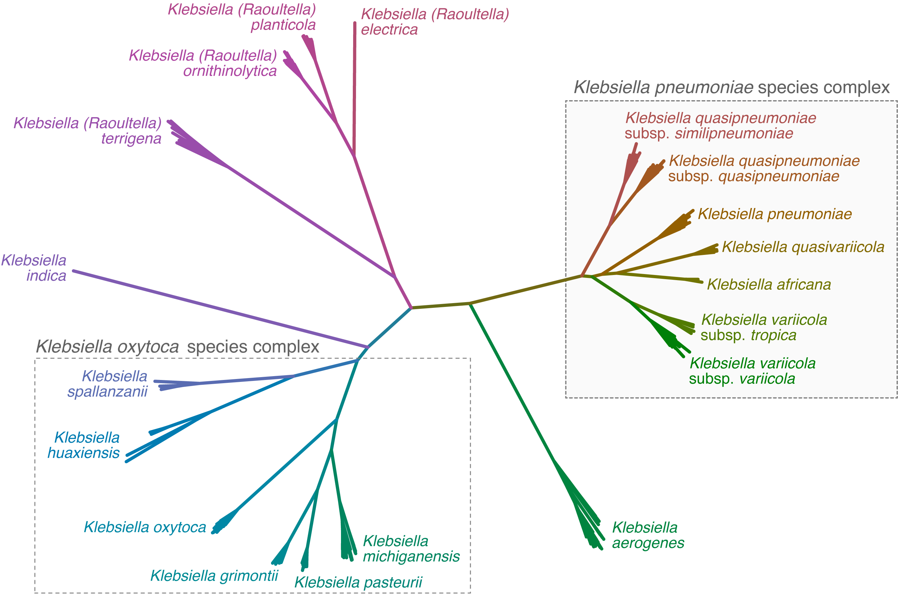

****************************************************
Modules for *Klebsiella oxytoca* species complex
****************************************************

.. _kosc__mlst:

.. code-block:: Python

   --preset kosc

These modules will be run if the ``enterobacterales__species``\   module confirms the input assembly as a member of the *K. oxytoca* species complex (KoSC) labelled in the tree above, and listed in the table below. 

.. list-table::

   * - Klebsiella oxytoca

   * - Klebsiella grimontii

   * - Klebsiella michiganensis

   * - Klebsiella pasteurii

   * - Klebsiella huaxiensis

   * - Klebsiella spallanzanii

MLST
---------

.. code-block:: Python

   -m kosc__mlst

Genomes identified as belonging to the *K. oxytoca* species complex are subjected to MLST using the 7-locus scheme described at the  *K. oxytoca* `\at PubMLST <https://pubmlst.org/organisms/klebsiella-oxytoca>`_.

A copy of the MLST alleles and ST definitions is stored in the ``data/`` directory of this module.

Parameters
+++++++++++++++++++++++

``--klebsiella_oxytoca_complex__mlst_min_identity`` 

Minimum alignment percent identity for klebsiella_oxytoca_complex MLST (default: 90.0)

``--klebsiella_oxytoca_complex__mlst_min_coverage`` 

Minimum alignment percent coverage for klebsiella_oxytoca_complex MLST (default: 80.0)

``--klebsiella_oxytoca_complex__mlst_required_exact_matches``

At least this many exact matches are required to call an ST (default: 3)

Outputs
++++++++++++++++++++

Output of the KoSC MLST module is the following columns:

.. list-table::

   * - **Column name**
     - **Content**

   * - ST
     - sequence type

   * - gapA, infB, mdh, pgi, phoE, rpoB, tonB
     - allele number

* Kleborate makes an effort to report the closest matching ST if a precise match is not found.
* Imprecise allele matches are indicated with a ``*``.
* Imprecise ST calls are indicated with ``-nLV``\ , where n indicates the number of loci that disagree with the ST reported. So ``258-1LV`` indicates a single-locus variant (SLV) of ST258, i.e. 6/7 loci match ST258.

Virulence typing
---------------------
Genomes identified as belonging to the *K. oxytoca* species complex are subjected to typing for yersiniabactin, colibactin, aerobactin, salmochelin and rmp loci, using the following modules:

.. code-block:: Python

   -m klebsiella__ybst, klebsiella__cbst, klebsiella__abst, klebsiella__smst, klebsiella__rmst

These modules were primarily designed for typing of *K. pneumoniae* species complex, and the databases are populated from variation detected in KpSC genomes (see details on the KpSC modules page :ref:`here <kpsc_virulence>`). However they can appear in KoSC genomes and so typing is included in the KoSC preset. A more focused database capturing variation across KoSC is planned.

.. _kosc__kaptive:

K and O locus typing
-----------------------------------------

.. code-block:: Python

   -m kosc__kaptive

This module will run the `Kaptive <https://github.com/klebgenomics/kaptive>`_ v3 tool to identify capsule (K) and O antigen loci based on the *K. oxytoca* species complex `database <https://github.com/klebgenomics/KoSC-surface-antigen-loci>`_ described in this `paper <https://doi.org/10.64898/2026.07.16.739023>`_. See the `Kaptive documentation <https://klebgenomics.github.io/Kaptive/index.html>`_ for more details of how Kaptive works, tutorials, and citations.

Parameters
+++++++++++++++++++

``-kosc_k``

Kaptive database for Kosc K-locus typing

``-kosc_o``

Kaptive database for Kosc O-locus typing

Outputs
+++++++++++++++++

Kaptive results are output in the following columns:

.. list-table::
   :header-rows: 1
   * - **Column name**
     - **Content**
   * - K_locus
     - The K locus type which most closely matches the assembly.
   * - K_type
     - The predicted capsule serotype/phenotype of the assembly.
   * - K_locus_confidence
     - Typeable or Untypeable.
   * - K_locus_problems
     - Characters indicating issues with the K locus match (see problems).
   * - K_locus_identity
     - Weighted percent identity of the best matching K locus to the assembly.
   * - K_Missing_expected_genes
     - A string listing the gene names of expected K locus genes that were not found.
   * - O_locus
     - The O locus type which most closely matches the assembly.
   * - O_type
     - The predicted O antigen serotype/phenotype of the assembly.
   * - O_locus_confidence
     - Typeable or Untypeable.
   * - O_locus_problems
     - Characters indicating issues with the O locus match (see problems).
   * - O_locus_identity
     - Weighted percent identity of the best matching O locus to the assembly.
   * - O_Missing_expected_genes
     - A string listing the gene names of expected O locus genes that were not found.
