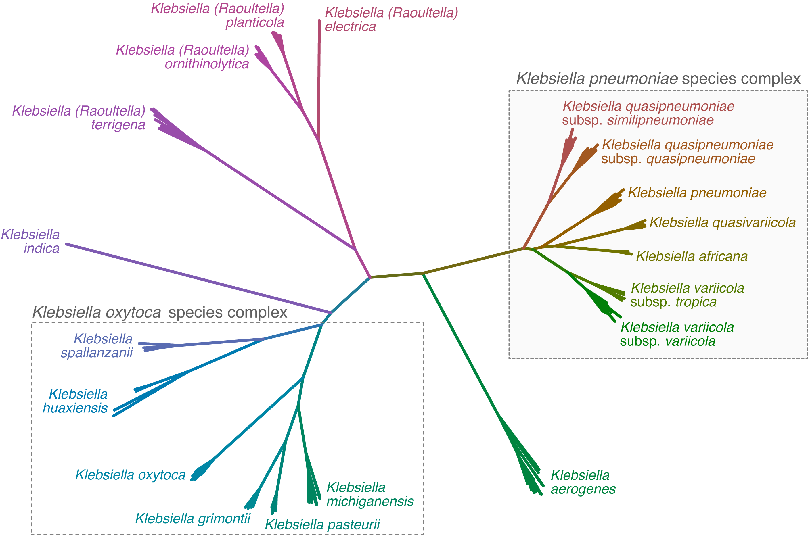

****************************************************
Modules for *Klebsiella pneumoniae* species complex
****************************************************

.. code-block:: Python

   --preset kpsc

These modules will be run if the ``enterobacterales__species``\   module confirms the input assembly as a member of the *K. pneumoniae* species complex (KpSC) labelled in the tree below. 

We've included the phylogroup numbers in the table below for backwards compatibility with older literature, but these names are not used in the Kleborate output. See `this review <https://www.nature.com/articles/s41579-019-0315-1>`_ for an overview of the species complex. 

.. list-table::
   :header-rows: 1

   * - Species
     - Kp phylogroup\ :sup:`a`
     - Kp phylogroup (alternative)\ :sup:`b`
     - Reference
   * - *K. pneumoniae*
     - Kp1
     - KpI
     - `Brenner, D.J. 1979 Int J Syst Evol Microbiol 29: 38-41 <https://ijs.microbiologyresearch.org/content/journal/ijsem/10.1099/00207713-29-1-38>`_
   * - *K. quasipneumoniae* subsp *quasipneumoniae*
     - Kp2
     - KpIIa
     - `Brisse et al., 2014 Int J Syst Evol Microbiol 64:3146-52 <https://ijs.microbiologyresearch.org/content/journal/ijsem/10.1099/ijs.0.062737-0#tab2>`_
   * - *K. quasipneumoniae* subsp *similipneumoniae*
     - Kp4
     - KpIIb
     - `Brisse et al. 2014 Int J Syst Evol Microbiol 64:3146-52 <https://ijs.microbiologyresearch.org/content/journal/ijsem/10.1099/ijs.0.062737-0#tab2>`_
   * - *K. variicola* subsp *variicola*
     - Kp3
     - KpIII
     - `Rosenblueth et al. 2004 Syst Appl Microbiol 27:27-35 <https://www.sciencedirect.com/science/article/abs/pii/S0723202004702349?via%3Dihub>`_
   * - *K. variicola* subsp *tropica*
     - Kp5
     - `-`
     - `Rodrigues et al., 2019 Res Microbiol S0923-2508:30019-1 <https://www.sciencedirect.com/science/article/pii/S0923250819300191?via%3Dihub>`_ (described as subsp *tropicalensis* in paper)
   * - *K. quasivariicola*
     - Kp6
     - `-`
     - `Long et al. 2017 Genome Announc 5: e01057-17 <https://mra.asm.org/content/5/42/e01057-17>`_
   * - *K. africana*
     - Kp7
     - `-`
     - `Rodrigues et al. 2019 Res Microbiol S0923-2508:30019-1 <https://www.sciencedirect.com/science/article/pii/S0923250819300191?via%3Dihub>`_ (described as *africanensis* in this paper)

:sup:`a` Kp phylogroup numbers as described in `Rodrigues et al. 2019 <https://www.sciencedirect.com/science/article/pii/S0923250819300191?via%3Dihub>`_

:sup:`b` alternative (older) Kp phylogroup numbers as described in `Brisse et al. 2001 <https://ijs.microbiologyresearch.org/content/journal/ijsem/10.1099/00207713-51-3-915#tab2>`_ and `Fevre et al. 2005 <https://aac.asm.org/content/49/12/5149>`_ prior to the identification of *K. variicola* subsp *tropica*\ , *K. quasivariicola* and *K. africana*.

.. _klebsiella_pneumo_complex_mlst:

KpSC MLST
---------

.. code-block:: Python

   -m klebsiella_pneumo_complex__mlst

Genomes identified by Kleborate as belonging to the *K. pneumoniae* species complex are subjected to MLST using the 7-locus scheme described at the  *K. pneumoniae* `\Bacteria Isolate Genome Sequence Database hosted at the Pasteur Institute <https://bigsdb.pasteur.fr/klebsiella/>`_. Note that this scheme is not specific to *K. pneumoniae sensu stricto* but covers the whole species complex. 

A copy of the MLST alleles and ST definitions is stored in the **/data** directory of this module.

Rhinoscleromatis and Ozaenae
^^^^^^^^^^^^^^^^^^^^^^^^^^^^

The *K. pneumoniae* clonal group CG67 is known as *K. pneumoniae* subsp. *rhinoscleromatis* because it causes rhinoscleroma (chronic granulomatous infection of the nose and upper airways), and clonal group CG91 is known as *K. pneumoniae* subsp. *ozaenae* as it can cause ozena (atrophic rhinitis). To alert users to this, when STs belonging to these clonal groups are detected by Kleborate this is flagged in the ST column, e.g. 'ST67 (subsp. rhinoscleromatis)' or 'ST97 (subsp. ozaenae)'. 

The relevant STs are:

.. list-table::

   * - **Species column**
     - **ST**
     - **MLST column**
   * - *K. pneumoniae*
     - 67, 68, 69, 3772, 3819
     - ST67 (subsp. rhinoscleromatis)
   * - *K. pneumoniae*
     - 90, 91, 92, 93, 95, 96, 97, 381, 777, 3193
       3766, 3768, 3771, 3781, 3782, 3784, 3802, 3803
     - ST91 (subsp. ozaenae)

Parameters
++++++++++

``--klebsiella_pneumo_complex__mlst_min_identity``

Minimum alignment percent identity for klebsiella_pneumo_complex_MLST (default: 90.0)

``--klebsiella_pneumo_complex__mlst_min_coverage`` 

Minimum alignment percent coverage for klebsiella_pneumo_complex_MLST (default: 80.0)

``--klebsiella_pneumo_complex__mlst_required_exact_matches`` 

At least this many exact matches are required to call an ST (default: 3)

Outputs
+++++++

Output of the KpSC MLST module is the following columns:

.. list-table::

   * - ST
     - sequence type

   * - gapA, infB, mdh, pgi, phoE, rpoB, tonB
     - allele number

* Kleborate makes an effort to report the closest matching ST if a precise match is not found.
* Imprecise allele matches are indicated with a ``*``.
* Imprecise ST calls are indicated with ``-nLV``\ , where n indicates the number of loci that disagree with the ST reported. So ``258-1LV`` indicates a single-locus variant (SLV) of ST258, i.e. 6/7 loci match ST258.

KpSC virulence modules
----------------------

Typing modules are available for the five key acquired virulence loci that are associated with invasive infections and are found at high prevalence among hypervirulent *K. pneumoniae* strains: the siderophores yersiniabactin (\ *ybt*\ ), aerobactin (\ *iuc*\ ) and salmochelin (\ *iro*\ ), the genotoxin colibactin (\ *clb*\ ), and the hypermucoidy locus *rmpADC*. Each of these loci comprises multiple genes and will only be reported if >50% of the genes are detected. 

There is also a module to screen for the alternative hypermucoidy marker gene *rmpA2*.

For each module, if the target locus is detected, the typer will:

* Call a sequence type using the same logic as for 7-gene MLST
* Report the phylogenetic lineage associated with each sequence type, as outlined below and detailed in the corresponding papers
* Report the structural variant of the mobile genetic element that is usually associated with that phylogenetic lineage (for *ybt* and *rmpADC* only)

The *ybt*\ , *clb*\ , *iuc*\ , *iro* and *rmpADC* locus-specific ST schemes, and *rmpA2* alleles, are defined in the *K. pneumoniae* `Bacterial Isolate Genome Sequence Database <https://bigsdb.pasteur.fr/klebsiella/>`_. 

Notes on virulence allele reporting:
~~~~~~~~~~~~~~~~~~~~~~~~~~~~~~~~~~~~~~

Virulence alleles are treated in the same way as [MLST] alleles:

* In order to consider a Minimap2 hit, it must exceed both 80% identity and 40% coverage (adjustable via the --min_spurious_identity and --min_spurious_coverage options).
* Hits that fail to meet 90% identity and 80% coverage (adjustable via the ``--min_identity`` and ``--min_coverage`` options) are reported in the ``spurious_virulence_hits`` column but not used for sequence typing.
* Imperfect hits (either <100% identity or <100% coverage) are reported with a ``*``. E.g. ``15*`` means that no perfect match was found but the closest match is allele 15.
* Kleborate will next translate the hit into amino acid sequence and look for truncations (expressed as % amino acid length from the start codon). If the result is less than 90%, it is added to the result (e.g. ``15*-42%``\ ).

Notes on virulence sequence type reporting:
~~~~~~~~~~~~~~~~~~~~~~~~~~~~~~~~~~~~~~~~~~~~

* Virulence locus STs are only reported if >50% of the genes in a locus are detected (e.g. at least 6 of the 11 *ybt* locus genes are required to report a *ybt* ST).
* If <50% of the genes in a locus are detected, Kleborate reports the ST as ``0`` and the lineage as ``-``.
* If <100% but >50% of the genes in a locus are detected, Kleborate will report the locus as (incomplete), along with the closest matching ST and its corresponding phylogenetic lineage. E.g. if only 7 of the 11 *ybt* genes are detected, this will be reported as ``ybtX; ICEKpX (incomplete)``.
* For genomes with multiple copies of a virulence locus (e.g. a strain that carries ICE *Kp1* and the KpVP-1 plasmid will have two copies of *iro* and *rmp*\ ), Kleborate will report and assign a ST or closest matching ST to each of these virulence loci provided that the locus is relatively intact in the genome (i.e. >50% of the genes in a locus are present on a single contig) and according to the above criteria.  

.. _klebsiella__ybst:
.. _klebsiella__cbst:

Yersiniabactin and colibactin
^^^^^^^^^^^^^^^^^^^^^^^^^^^^^^^^

.. code-block:: Python

   -m klebsiella__ybst, klebsiella__cbst

We previously explored the diversity of the *K. pneumoniae* integrative conjugative element (ICE *Kp*), which mobilises the yersiniabactin locus *ybt*, using genomic analysis of a diverse set of 2498 *Klebsiella* (see `this article <http://mgen.microbiologyresearch.org/content/journal/mgen/10.1099/mgen.0.000196>`_\ ). Overall, we found *ybt* in about a third of all *K. pneumoniae* genomes (and *clb* in about 14%). We identified 17 distinct lineages of *ybt* (see figure) embedded within 14 structural variants of ICE *Kp* that can integrate at any of four tRNA-Asn sites in the chromosome. One type was found to be plasmid-borne. Based on this analysis, we developed a MLST-style approach for assigning yersiniabactin sequence types (YbST) and colibactin sequence types (CbST), which is implemented in Kleborate. 

Note that while ICE *Kp1* is occasionally found in other species within the KpSC, and even in other genera of Enterobacteriaceae (see `original paper <http://mgen.microbiologyresearch.org/content/journal/mgen/10.1099/mgen.0.000196>`_\ ), most of the known variation included in the database is derived from *K. pneumoniae*.

The allele databases and schemes were last updated in April 2024. The number of ybt lineages is now 28, and the number of ICE*Kp structural variants is 22.

ybst Parameters
++++++++++++++++++

``--klebsiella__ybst_min_identity``

Minimum alignment percent identity for yersiniabactin MLST (default: 90.0)

``--klebsiella__ybst_min_coverage``

Minimum alignment percent coverage for yersiniabactin MLST (default: 80.0)

``--klebsiella__ybst_required_exact_matches``

At least this many exact matches are required to call an ST (default: 6)

ybst Outputs
++++++++++++++++++

Output of the ybst module is the following columns:

.. list-table::

   * - Yersiniabactin
     - Lineage (ICEKp prediction)

   * - YbST
     - Yersiniabactin sequence type

   * - ybtS, ybtX, ybtQ, ybtP, ybtA, irp2, irp1, ybtU, ybtT, ybtE, fyuA
     - allele number (ybt locus)

cbst Parameters
++++++++++++++++++

``--klebsiella__cbst_min_identity``

Minimum alignment percent identity for colibactin MLST (default: 90.0)

``--klebsiella__cbst_min_coverage``

Minimum alignment percent coverage for colibactin MLST (default: 80.0)

``--klebsiella__cbst_required_exact_matches``

At least this many exact matches are required to call an ST (default: 8)

cbst Outputs
++++++++++++++++++

Output of the cbst module is the following columns:

.. list-table::

   * - Colibactin
     - Lineage

   * - CbST
     - Colibactin sequence type

   * - clbA, clbB, clbC, clbD, clbE, clbF, clbG, clbH, clbI, clbL, clbM, clbN, clbO, clbP, clbQ
     - allele number (clb / pks locus)

.. _klebsiella__abst:

.. _klebsiella__smst:

Aerobactin and salmochelin
^^^^^^^^^^^^^^^^^^^^^^^^^^^^^^

.. code-block:: Python

   -m klebsiella__abst, klebsiella__smst

We further explored the genetic diversity of the aerobactin (\ *iuc*\ ) and salmochelin (\ *iro*\ ) loci among a dataset of 2733 *Klebsiella* genomes (see `this publication <https://genomemedicine.biomedcentral.com/articles/10.1186/s13073-018-0587-5>`_\ ). We identified five *iro* and six *iuc* lineages, each of which was associated with a specific location within *K. pneumoniae* genomes (primarily virulence plasmids). Based on this analysis, we developed a MLST-style approach for assigning aerobactin sequence types (AbST) and salmochelin sequence types (SmST) which is implemented in Kleborate. 

* The most common lineages are *iuc1* and *iro1*\ , which are found together on the FIBk virulence plasmid KpVP-1 (typified by pK2044 or pLVPK common to the hypervirulent clones ST23, ST86, etc). 
* *iuc2* and *iro2* lineages were associated with the alternative FIBk virulence plasmid KpVP-2 (typified by Kp52.145 plasmid II from the K2 ST66 lab strain known as Kp52.145 or CIP 52.145 or B5055). 
* *iuc5* and *iro5* originate from *E. coli* and are carried (often together) on *E. coli* FII plasmids that can transfer to *K. pneumoniae*. 
* The lineages *iuc2A*\ , *iuc3* and *iro4* were associated with other novel FIBk plasmids that had not been previously described in *K. pneumoniae*\ , but sequences for which are included in `the paper <https://genomemedicine.biomedcentral.com/articles/10.1186/s13073-018-0587-5>`_. 
* The salmochelin locus present in ICE *Kp1* constitutes its own lineage *iro3*\ , and the aerobactin locus present in the chromosome of ST67 *K. pneumoniae* subsp *rhinoscleromatis* strains constitutes its own lineage *iuc4*. 

Note on *iucA* sequence update:
^^^^^^^^^^^^^^^^^^^^^^^^^^^^^^^^

In Kleborate version 2.2.0 and earlier, the majority of *iucA* alleles had a sequence length of 1791 bp, with the exception being those associated with lineage *iuc 5* which have a length of 1725 bp. Related to this, *iucA* in genomes with *iuc 3* encoded a premature stop codon resulting in a significantly truncated and presumably non-functional IucA protein (i.e. at 2% length of the intact amino acid sequence), despite experimental evidence showing siderophore activity in *iuc 3*\ + isolates. In light of this evidence, the sequences of *iucA* genes with the longer ~1791 bp length were updated to ~1725 bp by removing the first 66 bp. These changes are captured in Kleborate version 2.3.0 onwards, and address the truncation issue in *iuc 3*\ + genomes. The following *iucA* alleles and AbST profiles have also been retired due to sequence redundancy following the update:

* alleles: iucA48, iucA49, iucA52
* profiles: AbST 70, 82, 83

The allele databases and schemes were last updated in April 2024. 

abst Parameters
++++++++++++++++++

``--klebsiella__abst_min_identity``

Minimum alignment percent identity for aerobactin MLST (default: 90.0)

``--klebsiella__abst_min_coverage`` 

Minimum alignment percent coverage for aerobactin MLST (default: 80.0)

``--klebsiella__abst_required_exact_matches``

At least this many exact matches are required to call an ST (default: 3)

abst Outputs
++++++++++++++++++

Output of the abst module is the following columns:

.. list-table::

   * - Aerobactin
     - Lineage (plasmid prediction)

   * - AbST
     - Sequence type

   * - iucA, iucB, iucC, iucD, iutA
     - allele number (iuc locus)

smst Parameters
++++++++++++++++++

``--klebsiella__smst_min_identity``

Minimum alignment percent identity for salmochelin MLST (default: 90.0)

``--klebsiella__smst_min_coverage``

Minimum alignment percent coverage for salmochelin MLST (default: 80.0)

``--klebsiella__smst_required_exact_matches`` 

At least this many exact matches are required to call an ST (default: 2)

smst Outputs
++++++++++++++++++

Output of the smst module is the following columns:

.. list-table::

   * - Salmochelin
     - Lineage (plasmid prediction)

   * - SmST
     - Sequence type

   * - iroB, iroC, iroD, iroN
     - allele number (iro locus)

.. _klebsiella__rmst:

.. _klebsiella__rmpa2:

Hypermucoidy loci
^^^^^^^^^^^^^^^^^^

.. code-block:: Python

   -m klebsiella__rmst, klebsiella__rmpa2

The *rmpA* locus is associated with the hypermucoidy phenotype that is a virulence feature that is often observed in hypervirulent *K. pneumoniae* strains. Recent work has revealed that *rmpA* serves as a transcriptional regulator for the *rmpD* and *rmpC* genes, and together these genes comprise the *rmpADC* (or *rmp*\ ) locus. *rmpC* is involved in the upregulation of capsule expression while *rmpD* drives hypermucoviscosity (see the paper on `rmpC <https://mbio.asm.org/content/10/2/e00089-19>`_ and this one on `rmpD <https://mbio.asm.org/content/11/5/e01750-20>`_ for more information.) 

In light of this information, we screened and extracted the *rmpA*\ , *rmpD* and *rmpC* sequences from the 2733 genomes included in the aerobactin and salmochelin study, and generated a RmST typing scheme. We observed four distinct *rmp* lineages, which were associated with the KpVP-1 (\ *rmp 1*\ ), KpVP-2 (\ *rmp 2*\ ), *iuc2A* virulence plasmids (\ *rmp 2A*\ ), ICE *Kp1* (rmp 3) and the *rmp4* lineage which is associated with *K. pneumoniae* CG67 `Lam et al., 2024 BioRxiv <https://www.biorxiv.org/content/10.1101/2024.05.28.596137v1/>`_

The klebsiella__rmst module screens for *rmpADC* and will report a sequence type, along with the associated lineage and mobile genetic element.

The *rmpA2* gene is homologous to *rmpA*, and the klebsiella__rmpa2 module screens for alleles of *rmpA2*.

Note:
^^^^^^^^

* Alleles for each gene are sourced from the `BIGSdb-pasteur <https://bigsdb.pasteur.fr/klebsiella/>`_\ , while additional *rmpA* alleles have also been added to Kleborate.
* The *rmpA* and *rmpA2* genes share ~83% nucleotide identity so are easily distinguished.
* Unique (non-overlapping) nucleotide Minimap2 hits with >95% identity and >50% coverage are reported. Note multiple hits to the same gene are reported if found. E.g. the NTUH-K2044 genome carries *rmpA* in the virulence plasmid and also in ICE *Kp1* , which is reported in the *rmpA* column as ``rmpA_11(ICEKp1),rmpA_2(KpVP-1)``.
* As with the other virulence genes, truncations in the *rmpA* and *rmpA2* genes are expressed as a percentage of the amino acid length from the start codon, e.g. ``rmpA_5-54%`` indicates the RmpA protein is truncated after 54% length of the intact amino acid sequence. These truncations appear to be common, due to insertions and deletions within a poly-G tract, and almost certainly result in loss of protein function.

rmst Parameters
++++++++++++++++++

``--klebsiella__rmst_min_identity`` 

Minimum alignment percent identity for Rmp MLST (default: 90.0)

``--klebsiella__rmst_min_coverage``

Minimum alignment percent coverage for Rmp MLST (default: 80.0)

``--klebsiella__rmst_required_exact_matches``

At least this many exact matches are required to call an ST (default: 2)

rmst Outputs
++++++++++++++++++

Output of the rmst module is the following columns:

.. list-table::

   * - RmpADC
     - Lineage

   * - RmST
     - Sequence type

   * - rmpA, rmpD, rmpC
     - allele number (rmp locus)

rmpA2 Parameters
++++++++++++++++++

``--klebsiella__rmpa2_min_identity`` 

Minimum alignment percent identity for rmpA2 alleles (default: 90.0)

``--klebsiella__rmpa2_min_coverage``

Minimum alignment percent coverage for rmpA2 alleles (default: 80.0)

rmpA2 Outputs
++++++++++++++++++

Output of the rmst module is the following columns:

.. list-table::

   * - rmpA2
     - best matching allele

.. _klebsiella_pneumo_complex__virulence_score:

Virulence score
^^^^^^^^^^^^^^^^^^

.. code-block:: Python

   -m klebsiella_pneumo_complex__virulence_score

This module takes ``klebsiella__abst``, ``klebsiella__cbst``, ``klebsiella__ybst`` as  prerequisite and calculates a virulence score, which ranges from 0 to 5 as outlined below. Note neither the salmochelin (iro) locus nor rmpADC are explicitly considered in the virulence score, for simplicity. The iro and rmpADC loci typically appear alongside the aerobactin (iuc) locus on the Kp virulence plasmids, and so presence of iuc (score of 3-5) generally implies presence of iro and rmpADC. However we prioritise iuc in the calculation of the score, as aerobactin is specifically associated with growth in blood and is a stronger predictor of the hypervirulence phenotype `see this review <https://www.ncbi.nlm.nih.gov/pmc/articles/PMC6349525/>`_. The iro and rmpADC loci are also occasionally present with ybt, in the ICEKp variant - ICEKp1, but this will still score 1.

.. list-table::

   * - 0
     - negative for all of yersiniabactin (ybt), colibactin (clb), aerobactin (iuc)

   * - 1
     - yersiniabactin only

   * - 2
     - yersiniabactin and colibactin (or colibactin only)

   * - 3
     - aerobactin (without yersiniabactin or colibactin)

   * - 4
     - aerobactin with yersiniabactin (without colibactin)

   * - 5
     - yersiniabactin, colibactin and aerobactin

Virulence score outputs
++++++++++++++++++++++++++++++++++++++

Virulence score is output in the following column:

.. list-table::

   * - virulence_score
     - Score of 0-5, as defined above

.. _klebsiella_pneumo_complex__amr:

KpSC AMR
--------

.. code-block:: Python

   -m klebsiella_pneumo_complex__amr

Acquired AMR genes
^^^^^^^^^^^^^^^^^^

This module screens input genomes against a curated version of the `CARD database <https://card.mcmaster.ca/>`_ of acquired resistance gene alleles (see the following `spreadsheet <https://figshare.com/articles/dataset/CARD_v3_0_8_AMR_database_curation_for_Kleborate/13256759>`_ for details on curation), and groups these by drug class for reporting purposes. The chromosomal *fosA* and *oqxAB* genes that are intrinsic to all KpSC are not reported and usually do not confer fosfomycin/fluoroquinolone resistance in these species.

Kleborate has logic to choose the best allele hit, annotate that hit with extra information and place it in an approprirate column in the output.

In brief:

* Exact nucleotide matches are preferred, followed by exact amino acid matches, followed by inexact nucleotide matches.
* Annotations indicate aspects of the hit: ``^`` (inexact nucleotide but exact amino acid match), ``*`` (inexact nucleotide and inexact amino acid match), ``?`` (incomplete match), ``-X%`` (truncated amino acid sequence), ``$`` (mutated start codon, translation may be disrupted).
* The column indicates the confidence of the hit: strong hits go in the column for their drug class, truncated hits go in the ``truncated_resistance_hits`` column and low identity/coverage hits go in the ``spurious_resistance_hits`` column.

And here is the logic in more detail:

* In order to consider a Minimap hit, it must exceed both 80% identity and 40% coverage (adjustable via the ``--min_spurious_identity`` and ``--min_spurious_coverage`` options).
* If the hit is 100% identity and 100% coverage, then it will be reported with no further annotation (e.g. ``TEM-15``\ ).
* If no exact nucleotide match is found, Kleborate searches for an exact amino acid match, and will report this with a ``^`` symbol. E.g. ``TEM-15^`` indicates an exact match to the TEM-15 protein sequence but with one or more nucleotide differences.
* If no exact amino acid match is found, the closest nucleotide match is reported with a ``*`` symbol. E.g. ``TEM-15*`` indicates no precise nucleotide or amino acid match is found, but the closest nucleotide match is to TEM-15.
* If the hit is less than 100% coverage, a ``?`` is added to the result E.g. ``TEM-15?`` indicates an incomplete match at 100% identity, and ``TEM-15*?`` indicates an incomplete match at <100% identity.
* Kleborate will next translate the hit into amino acid sequence and look for truncations (expressed as % amino acid length from the start codon). If the result is less than 90%, it is added to the result (e.g. ``TEM-15*-42%``\ ) and the hit is reported in the ``truncated_resistance_hits`` column.
* If the hit is less than 90% identity or 80% nucleotide coverage (adjustable via the ``--min_identity`` and ``--min_coverage`` options), it is reported in the ``spurious_resistance_hits`` column. Otherwise, it is reported in the column for its drug class (e.g. ``Bla_ESBL_acquired``\ ).

Note that Kleborate reports resistance results for all antimicrobial classes with confidently attributable resistance mechanisms in KpSC. Not all of these are actually used clinically for treatment of KpSC infections (e.g. MLS, Rif) but they are still reported as the presence of acquired resistance determinants to these classes is of interest to researchers for other reasons (e.g. these genes can be useful markers of MGEs and MGE spread; there is potential for use of these drugs against other organisms to select for KpSC in co-infected patients or in the environment). For an overview of antimicrobial resistance and consensus definitions of multidrug resistance (MDR), extensive drug resistance (XDR) and pan drug resistance in Enterobacteriaceae, see `Magiorakos 2012 <https://www.clinicalmicrobiologyandinfection.com/article/S1198-743X(1461632-3/fulltext>`_\ 

SHV beta-lactamases
^^^^^^^^^^^^^^^^^^^

All KpSC carry a core chromosomal beta-lactamase gene (SHV in *K. pneumoniae*\ , LEN in *K. variicola*\ , OKP in *K. quasipneumoniae*\ ) that confers clinically significant resistance to ampicillin. Some KpSC also carry acquired mobile SHV alleles, which can confer additional inhibitor resistance and/or resistance to extended spectrum beta-lactams.

Kleborate will report all of the SHV alleles it detects and separate them into columns based on the resistance phenotype they are predicted to encode:

* SHV alleles associated with ampicillin resistance only, will be reported in the ``Bla_chr`` column because they are assumed to represent the chromosomal allele. These genes are not included in the count of acquired resistance genes or drug classes.
* Other SHV alleles e.g. those predicted to encode ESBLs (extended-spectrum beta-lactamases) or beta-lactamases with inhibitor resistance will be reported in the relevant ``Bla_ESBL_acquired`` or ``Bla_inhR_acquired`` columns etc (see below), because these SHV alleles are almost always carried on plasmids. (However it is possible to have a mutation in a chromosomal SHV gene that gives a match to an ESBL allele, which would also be reported in the ``Bla_ESBL_acquired`` column and counted as an acquired gene because it is very hard to tell the difference without manual exploration of the genetic context.)

The specific mutations, and assignment of alleles to class, is detailed in this preprint from KlebNET-GSP: `Tsang et al, 2024 Microbial genomics <https://doi.org/10.1099/mgen.0.001294>`_.

Additional chromosomal mutations associated with AMR
^^^^^^^^^^^^^^^^^^^^^^^^^^^^^^^^^^^^^^^^^^^^^^^^^^^^

* Fluoroquinolone resistance mutations: GyrA 83 & 87 and ParC 80 & 84. These appear in the ``Flq_mutations`` column.
* Colistin resistance due to truncation or loss of core genes MgrB or PmrB. If these genes are missing or truncated, this information will be reported in the 'Col_mutations' column (truncations are expressed as % amino acid length from the start codon, if there is a mutation in the start codon this is indicated as ``$`` to flag that the gene is present but may not be translated correctly). Note if MgrB and PmrB are present and not truncated then nothing about them will be reported in the 'Col' column.

* OmpK35 and OmpK36 truncations and point mutations shown to result in reduced susceptibility to beta-lactamases (`insertions GD or TD in the third loop <https://www.nature.com/articles/s41467-019-11756-y>`_ or `synonymous C > T at nucleotide 25 <https://doi.org/10.1073/pnas.2203593119>`_ ``ompK36_c25t``). This information will be reported in the ``Omp_mutations`` column (truncations are expressed as % amino acid length from the start codon ). Note that if a gene is fragmented across multiple contigs, Kleborate will attempt to predict the closest matching allele based on the longest fragment. If this longest fragment does not contain the start of the gene, the truncation will be reported as -0%. Additionally, if these core genes are present and not truncated then nothing about them will be reported in the 'Omp' column. The specific effect of OmpK mutations on drug susceptibility depends on multiple factors including what combinations of OmpK35 and OmpK36 alleles are present and what beta-lactamase genes are present (this is why we report them in their own column separate to Bla genes). See e.g. `paper <https://journals.plos.org/plospathogens/article?id=10.1371/journal.ppat.1007218>`_ and `this one <https://www.nature.com/articles/s41467-019-11756-y>`_ for more information on OmpK genes and drug resistance.

Note these do not count towards acquired resistance gene counts, but do count towards drug classes (with the exception of Omp mutations, whose spectrum of effects depends on the presence of acquired beta-lactamases and thus their impact on specific beta-lactam drug classes is hard to predict).

AMR parameters
++++++++++++++++++

``--klebsiella_pneumo_complex__amr_min_identity`` 

Minimum alignment percent identity for klebsiella_pneumo_complex Amr results (default: 90.0)

``--klebsiella_pneumo_complex__amr_min_coverage`` 

Minimum alignment percent coverage for klebsiella_pneumo_complex Amr results (default: 80.0)

``--klebsiella_pneumo_complex__amr_min_spurious_identity`` 

Minimum alignment percent identity for klebsiella_pneumo_complex Amr spurious results (default: 80.0)

``--klebsiella_pneumo_complex__amr_min_spurious_coverage`` 

Minimum alignment percent coverage for klebsiella_pneumo_complex Amr spurious results (default: 40.0)

AMR outputs
++++++++++++++++++

Results of the KpSC AMR module are grouped by drug class (according to the `ARG-Annot <https://www.ncbi.nlm.nih.gov/pubmed/24145532>`_ DB), with beta-lactamases further broken down into Lahey classes (now maintained at `BLDB <http://www.bldb.eu/>`_\ ), as follows:

.. list-table::

   * - AGly_acquired
     - aminoglycoside resistance genes

   * - Col_acquired
     - colistin resistance genes
     
   * - Fcyn_acquired
     - fosfomycin resistance genes
     
   * - Flq_acquired
     - fluoroquinolone resistance genes
     
   * - Gly_acquired
     - glycopeptide resistance genes
     
   * - MLS_acquired
     - macrolide resistance genes
     
   * - Phe_acquired
     - phenicol resistance genes
     
   * - Rif_acquired
     - rifampin resistance genes
     
   * - Sul_acquired
     - sulfonamide resistance genes
     
   * - Tet_acquired
     - tetracycline resistance genes
     
   * - Tgc_acquired
     - tigecycline resistance genes
     
   * - Tmt_acquired
     - trimethoprim resistance genes
     
   * - Bla_acquired
     - beta-lactamases (other than SHV) that have no known extended-spectrum, carbapenemase, or inhibitor-resistance activity

   * - Bla_ESBL_acquired
     - extended-spectrum beta-lactamases, including SHV alleles with known ESBL activity
   
   * - Bla_ESBL_inhR_acquired
     - extended spectrum beta-lactamases with resistance to beta-lactamase inhibitors, including SHV alleles associated with these traits 

   * - Bla_Carb_acquired
     - carbapenemases

   * - Bla_chr
     - SHV alleles associated with ampicillin resistance only (assumed core chromosomal genes)
   
   * - SHV_mutations
     - mutations in the SHV beta-lactamase known to be associated with expansion of enzyme activity
   
   * - Omp_mutations
     - resistance-related mutations in the OmpK35 and OmpK36 osmoporins
     
   * - Col_mutations
     - reports if MgrB or PmrB genes are not intact
     
   * - Flq_mutations
     - reports mutations found in the quinolone-resistance determining regions of GyrA and ParC
     
   * - truncated_resistance_hits
     - list of acquired resistance genes in which the encoded protein is predicted to be truncated (e.g. due to a stop codon or frameshift mutation within the open reading frame)
     
   * - spurious_resistance_hits
     - list of acquired resistance genes detected below the identity or coverage thresholds (default <90% identity or <80% nucleotide coverage)

Additionally, we provide a new AMR genotyping report compatible with the `hAMRonization <https://github.com/pha4ge/hAMRonization/blob/master/schema/PHA4GE%20AMR%20Gene%20%26%20Variant%20Specification.csv>`_. standard developed by the `Public Health Alliance for Genomic Epidemiology (PHA4GE) <https://www.biorxiv.org/content/10.1101/2024.03.07.583950v1>`_, thus improving the interoperability of Kleborate AMR results. 

hAMRonization report for Kleborate
++++++++++++++++++++++++++++++++++++

.. list-table::

   * - Input_file_name
     - The name of the file containing the sequence data to be analysed

   * - Gene_symbol
     - The short name of a gene
     
   * - Mutation
     - The amino acid/nucleotide sequence change(s) detected in the sequence being analyzed compared to a reference
     
   * - Genetic_variation_type
     - The class of genetic variation detected
     
   * - Drug_class
     - Set of antibiotic molecule
     
   * - Input Sequence ID
     - An identifier of molecular sequence(s) or entries from a molecular sequence database
     
   * - Input_gene_length
     - The length (number of positions) of a target gene sequence submitted by a user
     
   * - Input_gene_start
     - The position of the first nucleotide in a gene sequence being analyzed (input gene sequence)
     
   * - Input_gene_stop
     - The position of the last nucleotide in a gene sequence being analyzed (input gene sequence)
     
   * - Reference_gene_length
     - The length (number of positions) of a gene reference sequence retrieved from a database.
     
   * - Reference_gene_start
     - The position of the first nucleotide in a reference gene sequence (sequence being used for comparison)
     
   * - Sequence_identity
     - Sequence identity is the number (%) of matches (identical characters) in positions from an alignment of two molecular sequences.
     
   * - Coverage (percentage)
     - The percentage of the reference sequence covered by the sequence of interest.

   * - Reference_accession
     - An identifier that specifies an individual sequence record in a public sequence repository.

   * - Strand_orientation
     - The orientation of a genomic element on the double-stranded molecule.
     
   * - Software_name
     - A name of a computer package, application used for the analysis of data
     
   * - Software_version
     - The version of software used to analyze data
     
   * - Reference_database_name
     - An identifier of a biological or bioinformatics database
     
   * - Reference_database_version
     - The version of the database containing the reference sequences used for analysis
     
   * - Input_protein_length
     - The length (number of positions) of a protein target sequence submitted by a user
     
   * - Reference_protein_length
     - The length (number of positions) of a protein reference sequence retrieved from a database

.. _Resistance scores and counts:

Resistance scores and counts
^^^^^^^^^^^^^^^^^^^^^^^^^^^^

Running the KpSC AMR module automatically runs additional modules for generating counts of resistance genes and drug classes, and calculating a resistance score. These modules take  ``klebsiella_pneumo_complex__amr`` as a prerequisite and can be specified manually as follows:

.. code-block:: Python

   -m klebsiella_pneumo_complex__resistance_score, klebsiella_pneumo_complex__resistance_gene_count, klebsiella_pneumo_complex__resistance_class_count

Resistance score
''''''''''''''''''''''

This module calculates a resistance score, which ranges from 0 to 3 as follows

.. list-table::

   * - 0
     - no ESBL, no carbapenemase (regardless of colistin resistance)

   * - 1
     - ESBL, no carbapenemase (regardless of colistin resistance)

   * - 2
     - Carbapenemase without colistin resistance (regardless of ESBL genes or OmpK mutations)

   * - 3
     - Carbapenemase with colistin resistance (regardless of ESBL genes or OmpK mutations)

Resistance gene counts and drug class counts
''''''''''''''''''''''''''''''''''''''''''''''

This module quantifies how many acquired resistance genes are present and how many drug classes (in *addition* to ampicillin to which KpSC are intrinsically resistant) have at least one resistance determinant detected (i.e. ignoring genes recorded in the Bla_chr and Bla_acquired columns). 

A few things to note:

* The presence of resistance *mutations*\ , and non-ESBL forms of core genes SHV/LEN/OKP, do not contribute to the resistance *gene* count.
* Mutations do contribute to the drug class count, e.g. fluoroquinolone resistance will be counted if a GyrA mutation is encountered regardless of whether or not an acquired quinolone resistance (\ *qnr*\ ) gene is also present. The exceptions are Omp mutations, which do not contribute to the drug class count as their effect depends on the strain background and the presence of acquired beta-lactamase enzymes; hence this information is provided in a separate column, and interpretation is left to the user (see the `Antimicrobial Resistance <https://github.com/katholt/Kleborate/wiki/Antimicrobial-resistance>`_ page).
* Genes reported in the ``truncated_resistance_genes`` and ``spurious_resistance_genes`` columns do not contribute to the counts.
* Note that since a drug class can have multiple resistance determinants, the gene count is typically higher than the class count.

Resistance scores and counts outputs
++++++++++++++++++++++++++++++++++++++

Resistance scores and counts are output in the following columns:

.. list-table::

   * - resistance_score
     - Score of 0-3, as defined above

   * - num_resistance_genes
     - Number of acquired resistance genes

   * - num_resistance_classes
     - Number of drug classes to which resistance determinants have been acquired (in addition to intrinsic ampicillin)

.. _klebsiella_pneumo_complex__cipro_prediction:

Ciprofloxacin resistance prediction
++++++++++++++++++++++++++++++++++++

.. code-block:: Python

   -m klebsiella_pneumo_complex__cipro_prediction

Ciprofloxacin resistance prediction is performed based on assigning the genome to one of ten genotype profiles, based on:

(i) number of mutations in the quinolone resistance determining region (QRDR) of GyrA and ParC; 
(ii) number of plasmid-mediated quinolone resistance (PMQR) genes (i.e., *qep* and *qnr* genes); and 
(iii) the presence or absence of *aac(6`)-Ib-cr*. 
 

Each genotype profile is associated with a ciprofloxacin phenotype, in the form of a categorical assignment (wildtype S, nonwildtype I, nonwildtype R) and a minimum inhibitory concentration (MIC).

The association of each genotype profile with a phenotype is based on analysis of ~13 thousand genomes, by the `KlebNET-GSP AMR Genotype-Phenotype Group <https://klebnet.org/amrgenopheno/>`_, and the strength of the evidence from this data set is indicated in the **Positive predictive value** and **MIC** columns. The positive predictive value of the genotype profile is expressed as the raw number of genomes with that genotype, and the number of those which possess the associated phenotype. The **MIC** column indicates the median MIC value, and interquartile range of all MIC values, for isolates with this genotype profile.

The development and validation of the ciprofloxacin resistance prediction classifier is detailed in this preprint: `preprint link here once available`. 

.. list-table::

   * - **Genotype profile**
     - **Phenotype prediction**
     - **Positive predictive value**
     - **MIC (mg/L), median [interquartile range]**
   * - 0^ QRDR, 0 PMQR, 0 aac(6`)-Ib-cr
     - wildtype S
     - 90.99% S (N=5168/5680)
     - 0.25 mg/L [0.25-0.25]
   * - 0 QRDR, 0 PMQR, 1 aac(6`)-Ib-cr
     - wildtype S
     - 65.22% S (N=105/161)
     - 0.25 mg/L [0.25-0.5]
   * - 0 QRDR, qnrB1, 0 aac(6`)-Ib-cr
     - nonwildtype I
     - 81.25% I/R (n=130/160)
     - 0.5 mg/L [0.5-1]
   * - 1 QRDR, 0 PMQR, 0 aac(6`)-Ib-cr
     - nonwildtype R
     - 77.67% R (N=80/103)
     - 1 mg/L [1-2]
   * - 1 QRDR, 0 PMQR, 1 aac(6`)-Ib-cr
     - nonwildtype R
     - 86.96% R (N=20/23)
     - 2 mg/L [1-2]
   * - >1 QRDR, 0 PMQR, * aac(6`)-Ib-cr
     - nonwildtype R
     - 99.22% R (N=2150/2167)
     - 2 mg/L [2-4]
   * - 0 QRDR, 1^ PMQR, 0 aac(6`)-Ib-cr
     - nonwildtype R
     - 77.47% R (N=423/546)
     - 1 mg/L [1-2]
   * - 0 QRDR, 1 PMQR, 1 aac(6`)-Ib-cr
     - nonwildtype R
     - 94.63% R (N=775/819)
     - 2 mg/L [1-2]
   * - 0 QRDR, >1 PMQR, * aac(6`)-Ib-cr
     - nonwildtype R
     - 97.06% R (N=66/68)
     - 2 mg/L [2-4]
   * - >0 QRDR, >0 PMQR, * aac(6`)-Ib-cr
     - nonwildtype R
     - 99.22% R (N=2421/2440)
     - 4 mg/L [4-4]

* ^ GyrA-87G and GyrA-87H are not included in the QRDR count, and qnrB1 is excluded from the single-PMQR count.
* \* indicates the gene may be present or absent
* Note that *aac(6`)-Ib-cr* is reported in the AGly_acquired and Flq_acquired columns.

Results of the ciprofloxacin resistance prediction are reported in Kleborate with four additional columns: 

.. list-table::

   * - Ciprofloxacin_prediction
     - Indicates the categorical phenotype prediction for this genome (wildtype S, nonwildtype I, nonwildtype R)

   * - Ciprofloxacin_profile
     - Indicates which of the ten genotype profiles (from the table above) this genome was assigned to
     
   * - Ciprofloxacin_profile_support
     - Percentage indicating the positive predictive value of the genotype profile in **Ciprofloxacin_profile** for the S/I/R category indicated in **Ciprofloxacin_prediction**, based on evidence from the KlebNET-GSP AMR Genotype-Phenotype Group. The fraction in brackets (N=n/x) indicates the total number of genomes with this genotype profile (n), and the number of those which possess the associated phenotype (x), which were used to calculate the percentage.
     
   * - Ciprofloxacin_MIC_prediction
     - Indicates the MIC distribution observed for the genotype profile in **Ciprofloxacin_profile**, in the form of median value and interquartile range, based on the KlebNET-GSP AMR Genotype-Phenotype Group data enumerated in the **Ciprofloxacin_profile_support** column.

.. _klebsiella_pneumo_complex__kaptive:

KpSC K and O locus typing with Kaptive
-----------------------------------------

.. code-block:: Python

   -m klebsiella_pneumo_complex__kaptive

This module will run the `Kaptive <https://github.com/klebgenomics/kaptive>`_ v3 tool to identify capsule (K) and O antigen loci. See the Kaptive `documentation <https://kaptive.readthedocs.io/en/latest/>`_ for more details of how Kaptive works, tutorials, and citations.

Kaptive parameters
+++++++++++++++++++

``-t , --threads``

Number of threads for alignment (default: 1)

``--k-db, kpsc_k``

Kaptive database for K-locus typing

``--o-db, kpsc_o``

Kaptive database for o-locus typing

Kaptive outputs
+++++++++++++++++

Kaptive results are output in the following columns:

.. list-table::
   :header-rows: 1

   * - Column Name
     - Description
   * - Best match locus
     - The locus type which most closely matches the assembly.
   * - Best match type
     - The predicted serotype/phenotype of the assembly.
   * - Match confidence
     - Typeable or Untypeable.
   * - Problems
     - Characters indicating issues with the locus match (see problems).
   * - Identity
     - Weighted percent identity of the best matching locus to the assembly.
   * - Coverage
     - Weighted percent coverage of the best matching locus in the assembly.
   * - Length discrepancy
     - If the locus was found in a single piece, this is the difference between the locus length and the assembly length.
   * - Expected genes in locus
     - A fraction indicating how many of the genes in the best matching locus were found in the locus part of the assembly.
   * - Expected genes in locus, details
     - Gene names for the expected genes found in the locus part of the assembly.
   * - Missing expected genes
     - A string listing the gene names of expected genes that were not found.

.. _klebsiella_pneumo_complex__wzi:

KpSC Wzi typing for K antigen prediction
-----------------------------------------

.. code-block:: Python

   -m klebsiella_pneumo_complex__wzi

This module reports the closest match amongst the *wzi* alleles in the `BIGSdb <http://bigsdb.pasteur.fr/klebsiella/klebsiella.html>`_. This is a marker of capsule locus (KL) type, which is predictive of capsule (K) serotype. Although there is not a 1-1 relationship between *wzi* allele and KL/K type, there is a strong correlation (see `Wyres et al, MGen 2016 <http://mgen.microbiologyresearch.org/content/journal/mgen/10.1099/mgen.0.000102>`_ and `Brisse et al, J Clin Micro 2013 <https://jcm.asm.org/content/51/12/4073.long>`_). Note the *wzi database* is populated with alleles from the *Klebsiella pneumoniae* species complex and is not reliable for other species.

The *wzi* allele can provide a handy way of spotting the hypervirulence-associated capsule types (wzi=K1, wzi2=K2, wzi5=K5); or spotting capsule switching within clones, e.g. you can tell which ST258 lineage you have from the _wzi_ type (wzi154: the main lineage II; wzi29: recombinant lineage I; others: probably other recombinant lineages). But the K locus predictions from the Kaptive module are more specific and reliable.

Wzi outputs
+++++++++++++++

Wzi typing results are output in the following columns:

.. list-table::

   * - wzi
     - wzi allele

   * - K_locus
     - K locus typically associated with this wzi allele
